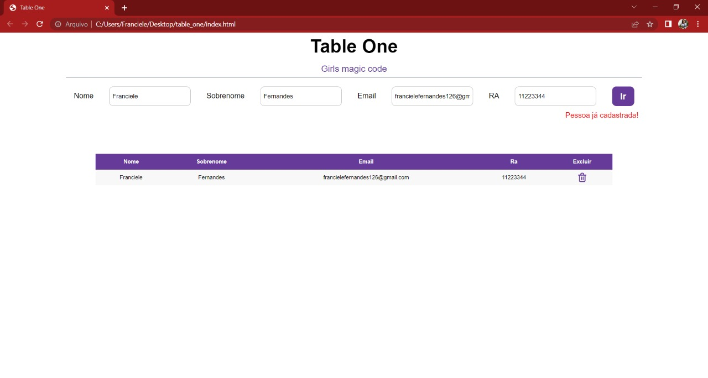

## Project Tble One
<h1 align="center">
    <a href="https://developer.mozilla.org/pt-BR/docs/Web/JavaScript">🔗 JavaScript</a>
</h1>

🚀 lib para construir interfaces dinamicamenente
  

🚧⏩Tabela de cadastro... Em construção⏪🚧

 

  

Hoje vamos fazer magia com os códigos, manipulando o DOM com JavaScript

 

## :books: Funcionalidades
* <b>Funcionalidade 1</b>: Manipular o DOM alimentado a tabela de acordo com os dados inseridos no formulário;